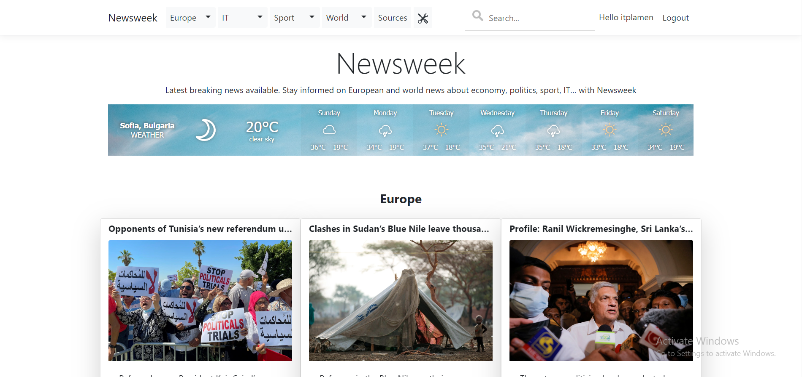
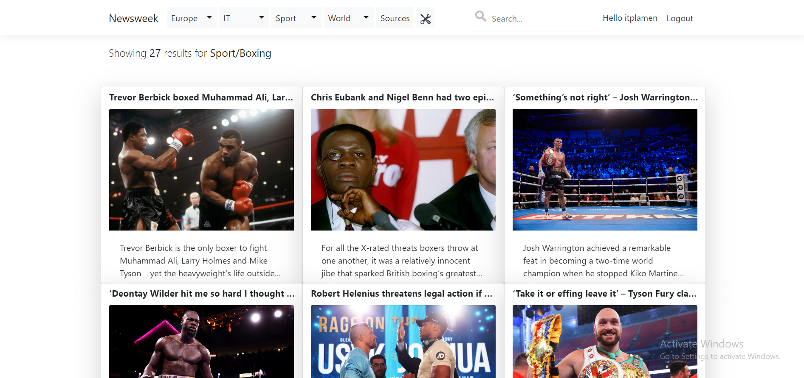

# Newsweek

Aggregates news from the world’s most popular websites, it displays content in real-time. There are separate categories for politics, tech news, sports, business, etc. **Use the Newsweek worker (either start the Console app or install the Windows Service) to get the latest news.**

http://www.newsweek.somee.com 
 
*Credentials: **demo@test.com / 123456** or create your own account.*

## Screenshots

## Sources

* [Euronews](https://www.euronews.com)
* [Al Jazeera](https://www.aljazeera.com)
* [talkSPORT](https://talksport.com)
* [CIO](https://www.cio.com)

## Technologies

* ASP.NET Core MVC 
* Entity Framework Core
* .NET Core Hosted Services
* CQS

## Libraries

* MediatR - [link](https://github.com/jbogard/MediatR)
* Automapper - [link](https://github.com/AutoMapper/AutoMapper)
* AngleSharp - [link](https://github.com/AngleSharp/AngleSharp)
* SendGrid - [link](https://sendgrid.com/)
* Moq, mocking framework - [link](https://github.com/moq/moq4)
* xUnit testing tool - [link](https://github.com/xunit/xunit)
